# ProjectFD 몬스터 시스템 분석 문서

## 목차
1. [개요](#개요)
2. [몬스터 클래스 설계 및 구조](#몬스터-클래스-설계-및-구조)
3. [몬스터 클래스 기능 구현](#몬스터-클래스-기능-구현)
4. [보스 몬스터 Parts 시스템](#보스-몬스터-parts-시스템)
5. [AnimNotify 및 AnimNotifyState 패턴](#animnotify-및-animnotifystate-패턴)
6. [AI 시스템](#ai-시스템)
7. [네트워크 동기화 및 RPC](#네트워크-동기화-및-rpc)

---

## 개요

ProjectFD는 언리얼 엔진 기반의 멀티플레이어 액션 게임으로, GAS(Gameplay Ability System)를 활용한 몬스터 시스템을 구현하고 있습니다. 이 문서는 몬스터 시스템의 전체 아키텍처, OOP 설계 원칙, 네트워크 동기화, AI 패턴 실행 메커니즘을 분석합니다.

### 핵심 기술 스택
- **GAS (Gameplay Ability System)**: 어빌리티 기반 전투 시스템
- **Behavior Tree & Blackboard**: AI 패턴 제어
- **Replication & RPC**: 멀티플레이어 동기화
- **AnimNotify/AnimNotifyState**: 애니메이션 이벤트 기반 패턴 실행

---

## 몬스터 클래스 설계 및 구조

### 클래스 계층 구조

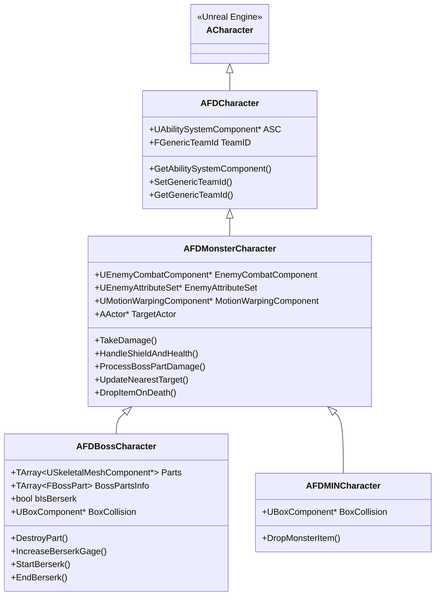

### OOP 설계 원칙 적용

#### 1. **상속을 통한 코드 재사용**

몬스터 시스템은 다층 상속 구조를 통해 공통 기능을 효율적으로 재사용합니다:

- **AFDCharacter**: GAS 통합 및 팀 시스템의 기반 클래스
- **AFDMonsterCharacter**: 모든 몬스터의 공통 기능 (데미지 처리, 타겟팅, 아이템 드롭)
- **AFDBossCharacter / AFDMINCharacter**: 특화된 몬스터 타입별 구현

#### 2. **인터페이스 패턴**

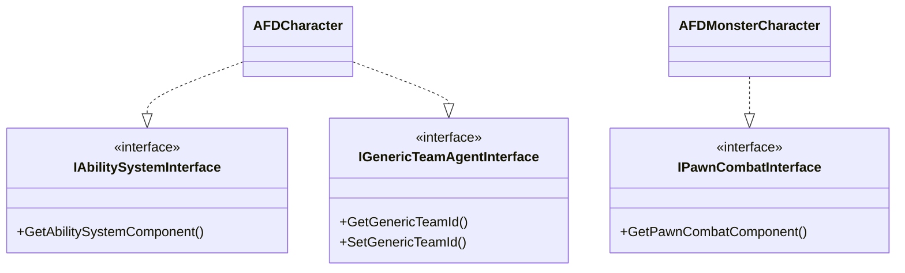

- **IAbilitySystemInterface**: GAS와의 표준 통합을 위한 인터페이스
- **IGenericTeamAgentInterface**: 팀 기반 적대 판정 시스템
- **IPawnCombatInterface**: 전투 컴포넌트 접근 추상화

#### 3. **컴포넌트 패턴 (Composition over Inheritance)**

몬스터는 기능별로 분리된 컴포넌트를 조합하여 구성됩니다:

```cpp
// AFDMonsterCharacter 생성자에서
EnemyCombatComponent = CreateDefaultSubobject<UEnemyCombatComponent>("EnemyCombatComponent");
ASC = CreateDefaultSubobject<UEnemyAbilitySystemComponent>("EnemyAbilitySystemComponent");
EnemyAttributeSet = CreateDefaultSubobject<UEnemyAttributeSet>("EnemyAttributeSet");
MotionWarpingComponent = CreateDefaultSubobject<UMotionWarpingComponent>("MotionWarpingComponent");
```

### 주요 변수 및 속성

#### FBossPart 구조체

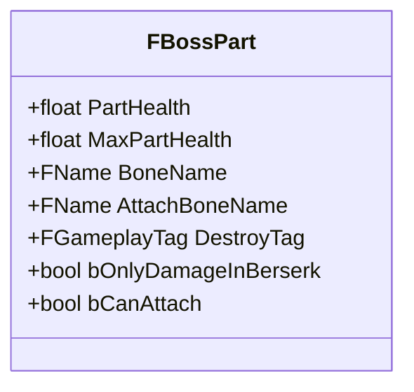

**주요 속성:**
- `PartHealth` / `MaxPartHealth`: 파츠의 체력 및 최대 체력
- `BoneName`: 피격 판정을 위한 본 이름
- `AttachBoneName`: 파츠가 부착된 소켓 이름
- `DestroyTag`: 파츠 파괴 시 활성화할 GameplayTag
- `bOnlyDamageInBerserk`: Berserk 모드에서만 데미지를 받는지 여부
- `bCanAttach`: 플레이어가 부착 가능한 상태인지 여부

#### AFDBossCharacter 주요 변수

```cpp
UPROPERTY(EditAnywhere, BlueprintReadWrite)
TArray<USkeletalMeshComponent*> Parts;  // 파츠 메시 목록

UPROPERTY(EditAnywhere, BlueprintReadWrite, Replicated)
TArray<FBossPart> BossPartsInfo;  // 파츠 정보 (네트워크 복제)

UPROPERTY(VisibleAnywhere, BlueprintReadWrite, Replicated)
bool bIsBerserk;  // Berserk 모드 활성화 상태

UPROPERTY()
int32 ExecutionCall_LoopCount;  // 패턴 루프 카운트

UPROPERTY()
FVector ExecutionCall_DamageVector;  // 데미지 방향
```

---

## 몬스터 클래스 기능 구현

### 1. 데미지 처리 시스템

#### 데미지 흐름도

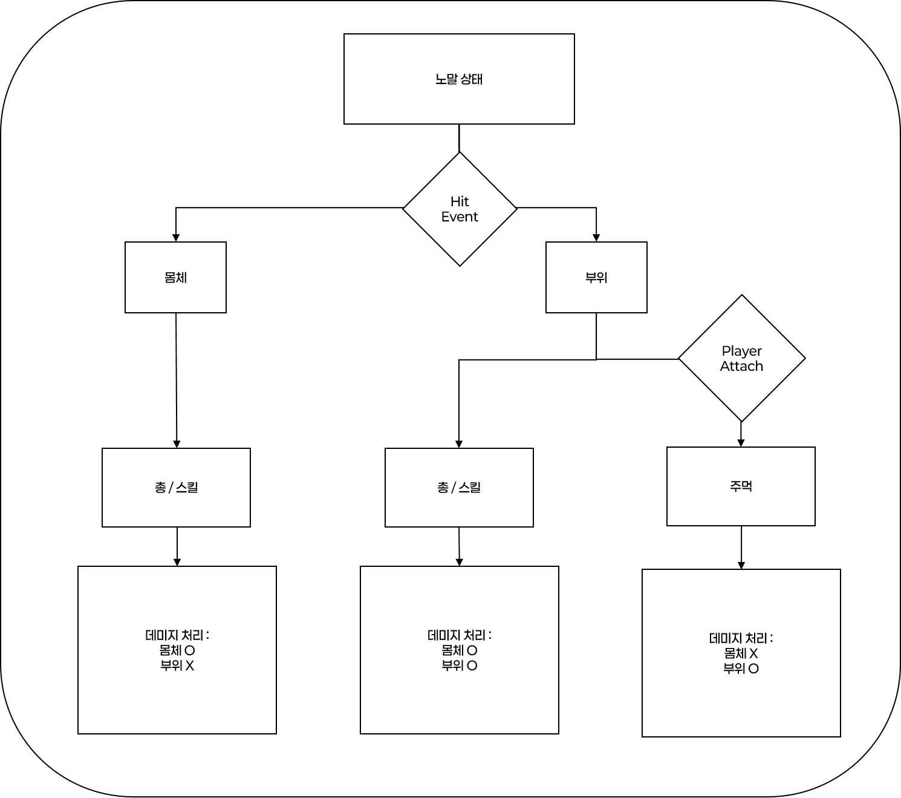
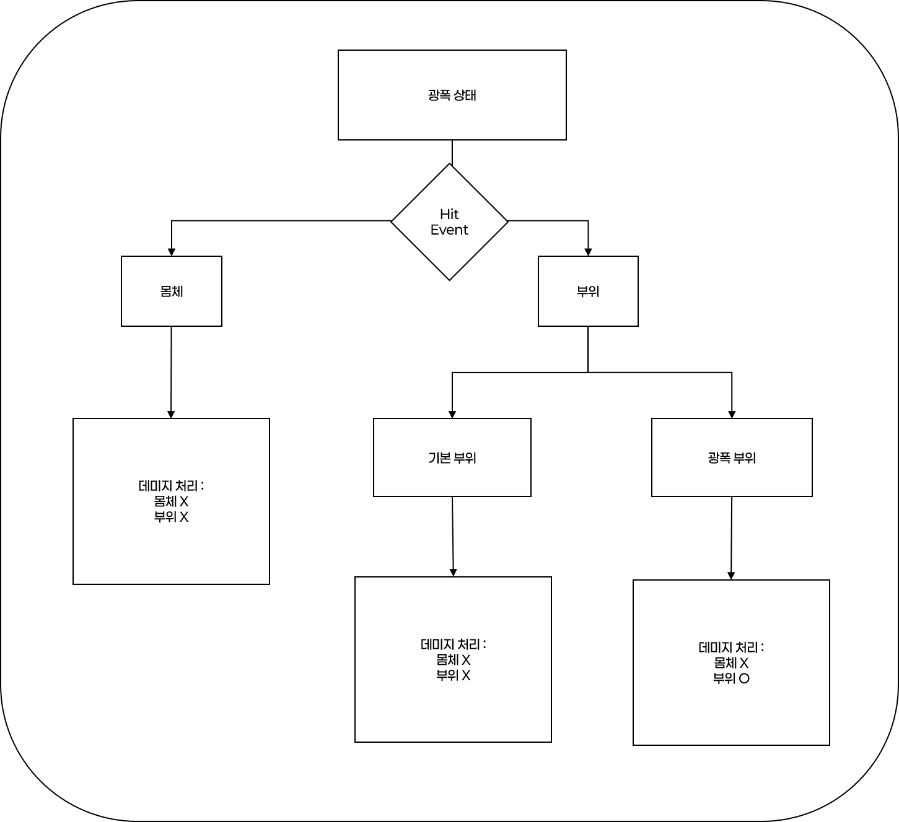

#### 핵심 구현 코드 분석

**1) ProcessBossPartDamage (보스 파츠 데미지 처리)**

```cpp
bool AFDMonsterCharacter::ProcessBossPartDamage(AActor* HitActor, float Damage, FName HitBone)
{
    AFDBossCharacter* Boss = Cast<AFDBossCharacter>(HitActor);
    if (!Boss) return false; // 일반 몬스터는 본체 데미지만 처리
    
    const bool bIsBerserkMode = UFDFunctionLibrary::NativeDoesActorHaveTag(this, 
        UFDGameplayStatic::GetBerserkModeTag());
    
    for (FBossPart& Part : Boss->BossPartsInfo)
    {
        if (Part.BoneName != HitBone) continue;
        
        // 케이스 1: Berserk 전용 파츠 + Berserk 모드
        if (Part.bOnlyDamageInBerserk && bIsBerserkMode)
        {
            Part.PartHealth -= Damage;
            // 체력에 따른 시각적 피드백
            if (Part.PartHealth > Part.MaxPartHealth * 0.4)
                Boss->NetMulticast_TwinklePart(Part.BoneName);
            else
                Boss->NetMulticast_TwinklePart_Warning(Part.BoneName);
            
            if (Part.PartHealth <= 0.f)
            {
                // 기믹 활성화 (파츠는 파괴하지 않음)
                Part.PartHealth = Part.MaxPartHealth;
                BossASC->TryActivateAbilityByTag(Part.DestroyTag);
            }
            return true; // 본체 데미지 차단
        }
        
        // 케이스 2: 일반 파츠 + Normal 모드
        if (!Part.bOnlyDamageInBerserk && !bIsBerserkMode)
        {
            // 펀치 vs 총기 데미지 차별화
            if (bIsPunch)
                Part.PartHealth -= Part.MaxPartHealth * 0.1;
            else
                Part.PartHealth -= Damage;
            
            if (Part.PartHealth <= 0.f)
            {
                Boss->DestroyPart(Part.BoneName); // 물리적 파괴
                BossASC->TryActivateAbilityByTag(Part.DestroyTag);
            }
            return false; // 본체에도 데미지 허용
        }
    }
    
    return bIsBerserkMode; // Berserk 중이면 본체 차단
}
```

**핵심 포인트:**
- **상태 기반 데미지 정책**: Berserk 모드 여부에 따라 파츠별로 다른 데미지 처리
- **물리적 파괴 vs 기믹 파괴**: 일반 파츠는 실제로 파괴되지만, Berserk 전용 파츠는 기믹만 활성화
- **타격 유형 구분**: `bBlockingHit`을 활용하여 펀치와 총기의 데미지 차별화

**2) HandleShieldAndHealth (실드 및 체력 처리)**

```cpp
void AFDMonsterCharacter::HandleShieldAndHealth(float Damage, AActor* HitActor)
{
    if (GetEnemyAttributeSet()->GetShield() > 0.f)
    {
        if (GetEnemyAttributeSet()->GetShield() < Damage)
        {
            // 실드 관통 데미지 계산
            float RemainingDamage = Damage - GetEnemyAttributeSet()->GetShield();
            GetEnemyAttributeSet()->SetShield(0);
            GetEnemyAttributeSet()->SetHealth(FMath::Max(
                GetEnemyAttributeSet()->GetHealth() - RemainingDamage, 0.f));
        }
        else
        {
            GetEnemyAttributeSet()->SetShield(GetEnemyAttributeSet()->GetShield() - Damage);
        }
    }
    else
    {
        GetEnemyAttributeSet()->SetHealth(FMath::Max(
            GetEnemyAttributeSet()->GetHealth() - Damage, 0.f));
    }
    
    if (GetEnemyAttributeSet()->GetHealth() <= 0.f)
    {
        GetEnemyAttributeSet()->SetHealth(0);
        DropItemOnDeath(HitActor);
    }
}
```

### 2. Berserk 모드 시스템

#### Berserk 모드 상태 전환


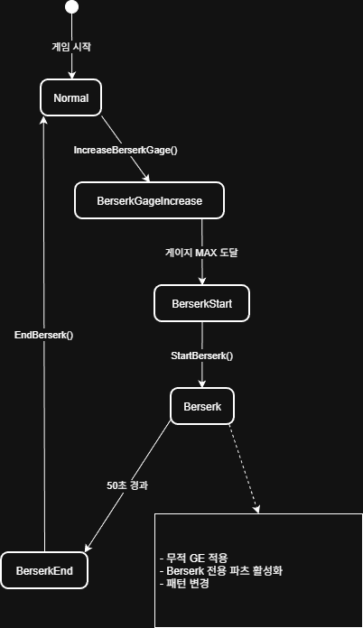

**구현 코드:**

```cpp
void AFDBossCharacter::StartBerserk()
{
    if (bIsBerserk || !HasAuthority()) return;
    
    // 1. 게이지 증가 GE 제거
    if (ActiveIncreaseBerserkGage.IsValid())
    {
        ASC->RemoveActiveGameplayEffect(ActiveIncreaseBerserkGage);
        ActiveIncreaseBerserkGage.Invalidate();
    }
    
    // 2. Berserk 상태 활성화
    bIsBerserk = true;
    GetEnemyAttributeSet()->SetBerserkGage(0.f);
    UFDFunctionLibrary::RemoveGameplayFromActorIfFound(this, 
        UFDGameplayStatic::GetNormalModeTag());
    UFDFunctionLibrary::AddGameplayTagToActorIfNone(this, 
        UFDGameplayStatic::GetBerserkStartTag());
    
    // 3. 무적 GE 적용
    if (ASC && BerserkGE)
    {
        FGameplayEffectSpecHandle SpecHandle = ASC->MakeOutgoingSpec(BerserkGE, 1.f, 
            ASC->MakeEffectContext());
        ActiveBerserkGE = ASC->ApplyGameplayEffectSpecToSelf(*SpecHandle.Data.Get());
    }
    
    // 4. 50초 타이머 설정
    GetWorld()->GetTimerManager().SetTimer(BerserkTimerHandle, this, 
        &AFDBossCharacter::EndBerserk, 50.f, false);
}
```

### 3. 타겟 시스템

```cpp
void AFDMonsterCharacter::UpdateNearestTarget()
{
    if (!HasAuthority()) return;
    
    AActor* Nearest = nullptr;
    float MinDist = FLT_MAX;
    
    // 모든 플레이어 컨트롤러 순회
    for (FConstPlayerControllerIterator It = GetWorld()->GetPlayerControllerIterator(); It; ++It)
    {
        if (AFDPlayerController* PC = Cast<AFDPlayerController>(It->Get()))
        {
            if (APawn* Pawn = PC->GetPawn())
            {
                // 팀 확인 (0번 팀만 타겟팅)
                if (AFDPlayerState* PS = Pawn->GetPlayerState<AFDPlayerState>())
                {
                    if (IGenericTeamAgentInterface* TeamAgent = 
                        Cast<IGenericTeamAgentInterface>(PS))
                    {
                        if (TeamAgent->GetGenericTeamId() != FGenericTeamId(0)) 
                            continue;
                    }
                }
                
                // 최근접 플레이어 찾기
                float Dist = FVector::Dist(Pawn->GetActorLocation(), GetActorLocation());
                if (Dist < MinDist)
                {
                    MinDist = Dist;
                    Nearest = Pawn;
                }
            }
        }
    }
    
    if (Nearest && Nearest != TargetActor)
    {
        TargetActor = Nearest;
        OnRep_TargetActor(); // 서버에서도 Blackboard 갱신
    }
}
```

---

## 보스 몬스터 Parts 시스템

### Parts 시스템 아키텍처

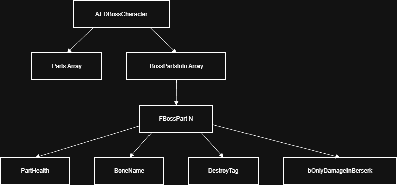

### Parts 초기화

```cpp
void AFDBossCharacter::BeginPlay()
{
    Super::BeginPlay();
    
    // 파츠 배열 구성
    Parts.AddUnique(HeadShell_L);
    Parts.AddUnique(HeadShell_R);
    Parts.AddUnique(RealCore);
    Parts.AddUnique(CoreShell);
    Parts.AddUnique(Knee_R);
    Parts.AddUnique(Knee_L);
    Parts.AddUnique(Clav_L);
    Parts.AddUnique(Clav_R);
    Parts.AddUnique(Plasma);
    
    // 길로틴 충돌 이벤트 바인딩
    BoxCollision->OnComponentBeginOverlap.AddUniqueDynamic(this, 
        &ThisClass::OnCollisionBeginOverlap);
    BoxCollision->OnComponentEndOverlap.AddUniqueDynamic(this, 
        &ThisClass::OnCollisionEndOverlap);
}
```

### Parts 파괴 메커니즘

**1) 파츠 물리적 파괴 (일반 모드)**

```cpp
void AFDBossCharacter::DestroyPart(const FName& BoneName)
{
    for (USkeletalMeshComponent* Part : Parts)
    {
        if (Part && Part->GetAttachSocketName() == BoneName)
        {
            // 컴포넌트 파괴
            Part->DestroyComponent();
            
            // 본 충돌 비활성화
            if (FBodyInstance* BI = GetMesh()->GetBodyInstance(BoneName))
            {
                if (BI->GetBodySetup())
                {
                    for (int32 i = 0; i < BI->GetBodySetup()->AggGeom.GetElementCount(); ++i)
                    {
                        BI->SetShapeCollisionEnabled(i, ECollisionEnabled::NoCollision);
                    }
                }
            }
        }
    }
}
```

**2) 파츠 시각 피드백 (RPC)**

```cpp
void AFDBossCharacter::NetMulticast_TwinklePart_Implementation(const FName& BoneName)
{
    for (USkeletalMeshComponent* Part : Parts)
    {
        if (Part && Part->GetAttachSocketName() == BoneName && BoneName != "Bn_CorePlasma")
        {
            // 파란색 피격 효과 (정상 상태)
            Part->SetVectorParameterValueOnMaterials("HitEmissiveColor", 
                FVector(FLinearColor(0.f, 0.f, 5.f, 1)));
            Part->SetScalarParameterValueOnMaterials("HitFxSwitch", 1.f);
            
            // 0.1초 후 효과 제거
            GetWorld()->GetTimerManager().SetTimer(TimerHandle, [Part]()
            {
                if (Part)
                    Part->SetScalarParameterValueOnMaterials("HitFxSwitch", 0.f);
            }, 0.1f, false);
            
            break;
        }
    }
}

void AFDBossCharacter::NetMulticast_TwinklePart_Warning_Implementation(const FName& BoneName)
{
    // 노란색 경고 효과 (체력 40% 미만)
    Part->SetVectorParameterValueOnMaterials("HitEmissiveColor", 
        FVector(FLinearColor(5.f, 5.f, 0.f, 1)));
    // ... (동일한 로직)
}
```

### Parts 기믹 처리

**플레이어 부착 기믹 (Clav 파츠)**

```cpp
// ProcessBossPartDamage 내부
if (Part.BoneName == "Dm_Clav_L")
{
    // 체력 40% 미만 + 아직 파괴되지 않았을 때
    if (!Part.bCanAttach && 
        Part.PartHealth <= (Part.MaxPartHealth * 0.4) && 
        !UFDFunctionLibrary::NativeDoesActorHaveTag(Boss, 
            UFDGameplayStatic::GetDestroyClav_L()))
    {
        Part.bCanAttach = true; // 플레이어 부착 가능 상태로 전환
    }
}
```

**부착 가능 상태 플로우:**

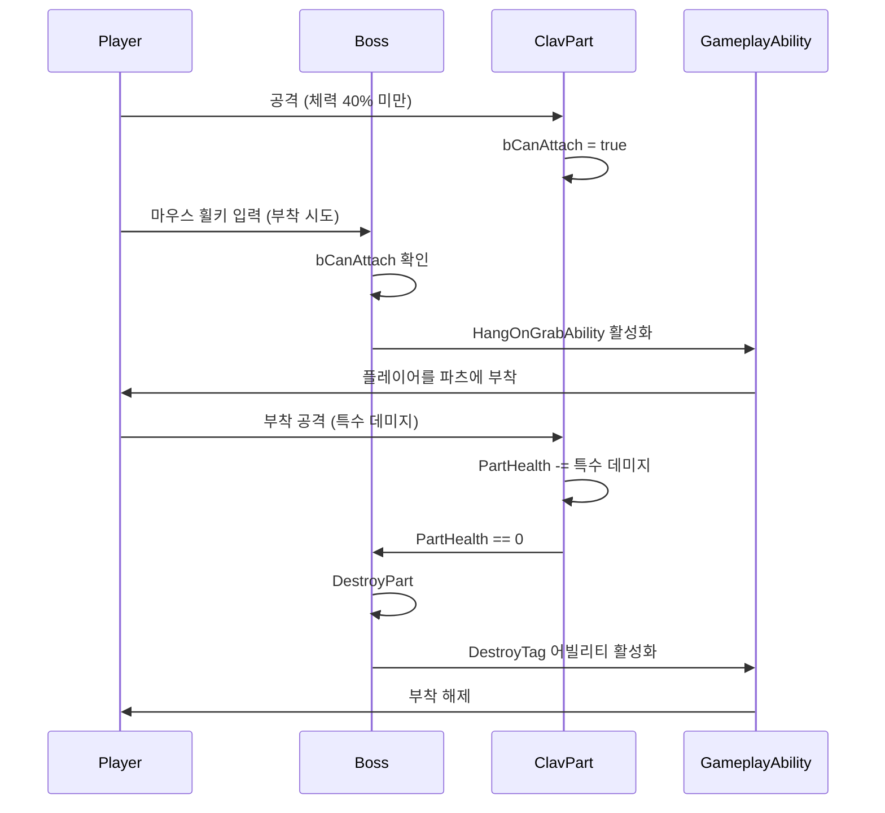

---

## AnimNotify 및 AnimNotifyState 패턴

### AnimNotify vs AnimNotifyState

| 구분          | AnimNotify                             | AnimNotifyState                         |
| ------------- | -------------------------------------- | --------------------------------------- |
| **실행 시점** | 특정 프레임 (단발성)                   | 시작~종료 구간 (지속성)                 |
| **주 용도**   | 이펙트 생성, 사운드 재생, 단일 이벤트  | 레이저 발사, 지속 트레이스, 충돌 활성화 |
| **예시**      | AN_BossMeleeAttack, AN_SpawnProjectile | ANS_NormalLaser, ANS_PlasmaNet          |

### 주요 AnimNotify 구현

#### 1. AN_BossMeleeAttack (근접 공격)

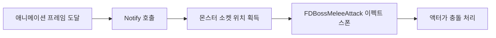

**코드:**

```cpp
void UAN_BossMeleeAttack::Notify(USkeletalMeshComponent* MeshComp, 
    UAnimSequenceBase* Animation)
{
    if (AActor* Owner = MeshComp->GetOwner())
    {
        FVector SocketLocation = MeshComp->GetSocketLocation(MeleeSocketName);
        FRotator SocketRotation = MeshComp->GetSocketRotation(MeleeSocketName);
        
        FActorSpawnParameters SpawnParams;
        SpawnParams.Owner = Owner;
        SpawnParams.Instigator = Cast<APawn>(Owner);
        
        Owner->GetWorld()->SpawnActor<AFDBossMeleeAttack>(
            MeleeAttackClass, 
            SocketLocation, 
            SocketRotation, 
            SpawnParams
        );
    }
}
```

#### 2. AN_SpawnProjectile (투사체 발사)

```cpp
void UAN_SpawnProjectile::Notify(USkeletalMeshComponent* MeshComp, 
    UAnimSequenceBase* Animation)
{
    if (AActor* Owner = MeshComp->GetOwner())
    {
        FVector MuzzleLocation = MeshComp->GetSocketLocation(MuzzleSocketName);
        FRotator MuzzleRotation = MeshComp->GetSocketRotation(MuzzleSocketName);
        
        FActorSpawnParameters SpawnParams;
        SpawnParams.Owner = Owner;
        SpawnParams.Instigator = Cast<APawn>(Owner);
        
        Owner->GetWorld()->SpawnActor<AFDProjectileBase>(
            ProjectileClass, 
            MuzzleLocation, 
            MuzzleRotation, 
            SpawnParams
        );
    }
}
```

### 주요 AnimNotifyState 구현

#### 1. ANS_NormalLaser (지속 레이저)

**실행 흐름:**

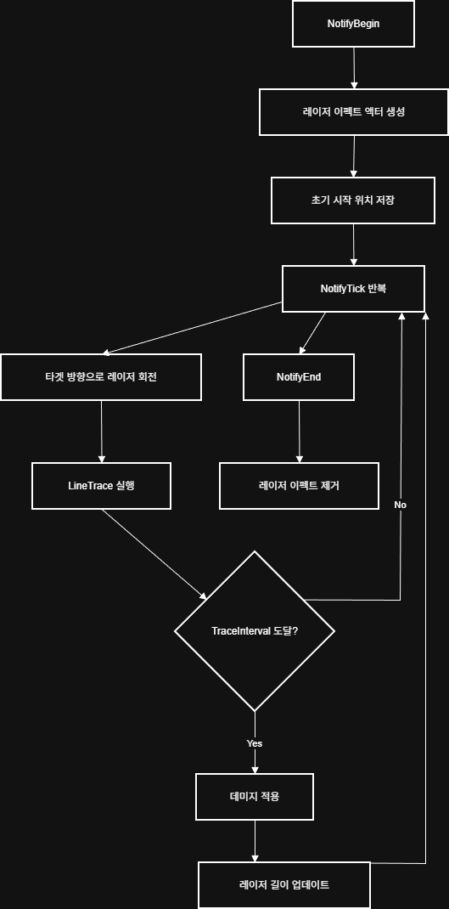

**핵심 코드:**

```cpp
void UANS_NormalLaser::NotifyBegin(USkeletalMeshComponent* MeshComp, 
    UAnimSequenceBase* Animation, float TotalDuration)
{
    if (AActor* Owner = MeshComp->GetOwner())
    {
        FVector MuzzleLocation = MeshComp->GetSocketLocation(MuzzleSocketName);
        
        // 레이저 이펙트 액터 생성
        LaserEffectActor = Owner->GetWorld()->SpawnActor<AFDBossNormalLaser>(
            LaserEffectActorClass, MuzzleLocation, FRotator::ZeroRotator);
        
        PrevEnd = MuzzleLocation;
        TimerAccumulator = 0.f;
    }
}

void UANS_NormalLaser::NotifyTick(USkeletalMeshComponent* MeshComp, 
    UAnimSequenceBase* Animation, float FrameDeltaTime)
{
    if (!LaserEffectActor) return;
    
    AActor* Owner = MeshComp->GetOwner();
    AFDMonsterCharacter* Monster = Cast<AFDMonsterCharacter>(Owner);
    
    // 타겟 추적
    FVector Start = MeshComp->GetSocketLocation(MuzzleSocketName);
    FVector TargetLocation = Monster->TargetActor->GetActorLocation();
    FVector Direction = (TargetLocation - Start).GetSafeNormal();
    
    // 부드러운 회전 보간
    FVector NewEnd = FMath::VInterpTo(PrevEnd, TargetLocation, 
        FrameDeltaTime, FollowSpeed);
    PrevEnd = NewEnd;
    
    // LineTrace로 충돌 감지
    FHitResult HitResult;
    FCollisionQueryParams Params;
    Params.AddIgnoredActor(Owner);
    
    if (GetWorld()->LineTraceSingleByChannel(HitResult, Start, 
        NewEnd + Direction * ExtraLength, ECC_Visibility, Params))
    {
        // 일정 간격마다 데미지 적용
        TimerAccumulator += FrameDeltaTime;
        if (TimerAccumulator >= TraceInterval)
        {
            if (AActor* HitActor = HitResult.GetActor())
            {
                UGameplayStatics::ApplyDamage(HitActor, Damage, 
                    Owner->GetInstigatorController(), Owner, nullptr);
            }
            TimerAccumulator = 0.f;
        }
    }
    
    // 레이저 이펙트 업데이트
    LaserEffectActor->UpdateLaser(Start, HitResult.Location);
}

void UANS_NormalLaser::NotifyEnd(USkeletalMeshComponent* MeshComp, 
    UAnimSequenceBase* Animation)
{
    if (LaserEffectActor)
    {
        LaserEffectActor->Destroy();
        LaserEffectActor = nullptr;
    }
}
```

#### 2. ANS_PlasmaNet (플라즈마 네트)

**다중 방향 레이저 패턴:**

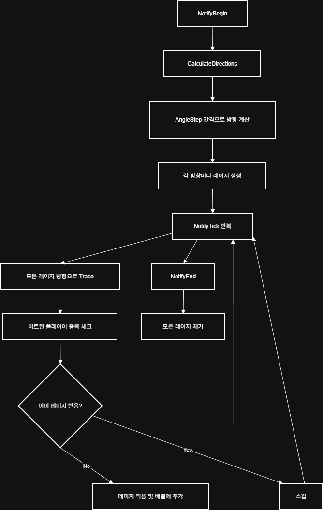

**핵심 코드:**

```cpp
void UANS_PlasmaNet::CalculateDirections(USkeletalMeshComponent* MeshComp)
{
    Directions.Empty();
    
    FVector MuzzleLocation = MeshComp->GetSocketLocation(MuzzleSocketName);
    FVector DirLocation = MeshComp->GetSocketLocation(DirSocketName);
    FVector BaseDir = (DirLocation - MuzzleLocation).GetSafeNormal();
    
    // 원형 패턴으로 방향 생성
    for (float Angle = 0.f; Angle < 360.f; Angle += AngleStep)
    {
        FRotator Rotation(0.f, Angle, 0.f);
        FVector Direction = Rotation.RotateVector(BaseDir);
        Directions.Add(Direction);
    }
}

void UANS_PlasmaNet::NotifyTick(USkeletalMeshComponent* MeshComp, 
    UAnimSequenceBase* Animation, float FrameDeltaTime)
{
    AActor* OwnerActor = MeshComp->GetOwner();
    FVector Start = MeshComp->GetSocketLocation(MuzzleSocketName);
    
    TArray<FHitResult> AllHits;
    
    // 각 방향으로 Sphere Trace
    for (int32 i = 0; i < Directions.Num(); ++i)
    {
        FVector End = Start + Directions[i] * BasicLength;
        TArray<FHitResult> HitResults;
        
        GetWorld()->SweepMultiByChannel(HitResults, Start, End, 
            FQuat::Identity, ECC_Visibility, 
            FCollisionShape::MakeSphere(Radius));
        
        AllHits.Append(HitResults);
        
        // 레이저 이펙트 업데이트
        if (LaserEffectActors.IsValidIndex(i))
        {
            LaserEffectActors[i]->UpdateLaser(Start, End);
        }
    }
    
    ProcessHits(AllHits, OwnerActor);
}

void UANS_PlasmaNet::ProcessHits(const TArray<FHitResult>& HitResults, 
    AActor* OwnerActor)
{
    for (const FHitResult& Hit : HitResults)
    {
        AActor* HitActor = Hit.GetActor();
        if (!HitActor || DamagedPlayers.Contains(HitActor))
            continue;
        
        // 중복 데미지 방지
        DamagedPlayers.Add(HitActor);
        
        UGameplayStatics::ApplyDamage(HitActor, Damage, 
            OwnerActor->GetInstigatorController(), OwnerActor, nullptr);
    }
}
```

### Berserk 모드 전환 Notify

```cpp
void UAN_BerserkNS::Notify(USkeletalMeshComponent* MeshComp, 
    UAnimSequenceBase* Animation)
{
    if (AFDBossCharacter* Boss = Cast<AFDBossCharacter>(MeshComp->GetOwner()))
    {
        if (bActive)
        {
            // Berserk 모드 시작 태그 제거 및 완료 태그 추가
            UFDFunctionLibrary::RemoveGameplayFromActorIfFound(Boss, 
                UFDGameplayStatic::GetBerserkStartTag());
            UFDFunctionLibrary::AddGameplayTagToActorIfNone(Boss, 
                UFDGameplayStatic::GetBerserkModeTag());
            
            Boss->NetMulticast_OnBerserk_NS(); // 나이아가라 이펙트 활성화
        }
        else
        {
            UFDFunctionLibrary::RemoveGameplayFromActorIfFound(Boss, 
                UFDGameplayStatic::GetNormalStartTag());
            UFDFunctionLibrary::AddGameplayTagToActorIfNone(Boss, 
                UFDGameplayStatic::GetNormalModeTag());
            
            Boss->NetMulticast_OffBerserk_NS();
        }
    }
}
```

---

## AI 시스템

### Behavior Tree 아키텍처

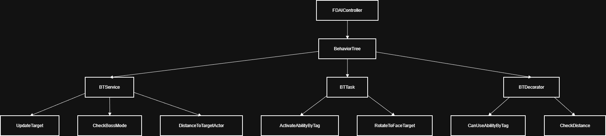

### FDAIController 구현

```cpp
class AFDAIController : public AAIController
{
    UPROPERTY(EditDefaultsOnly)
    FName TargetActorBlackboardKeyName = "TargetActor";
    
    UPROPERTY(EditDefaultsOnly)
    UBehaviorTree* BehaviorTree;
    
    UPROPERTY(VisibleAnywhere)
    UAIPerceptionComponent* EnemyPerceptionComponent;
    
    UPROPERTY(VisibleAnywhere)
    UAISenseConfig_Sight* AISenseConfig_Sight;
    
    UPROPERTY(ReplicatedUsing = OnRep_TargetActor)
    AActor* TargetActor;
};
```

**AI 인식 시스템:**

```cpp
void AFDAIController::OnEnemyPerceptionUpdated(AActor* Actor, FAIStimulus Stimulus)
{
    if (Stimulus.WasSuccessfullySensed())
    {
        // 적 감지 성공
        SetCurrentTarget(Actor);
    }
    else
    {
        // 적 시야에서 사라짐
        SetCurrentTarget(nullptr);
    }
}

void AFDAIController::SetCurrentTarget(AActor* NewTarget)
{
    if (HasAuthority())
    {
        TargetActor = NewTarget;
        
        if (UBlackboardComponent* BB = GetBlackboardComponent())
        {
            BB->SetValueAsObject(TargetActorBlackboardKeyName, TargetActor);
        }
    }
}
```

### BT Service: CheckBossMode

```cpp
void UBTService_CheckBossMode::TickNode(UBehaviorTreeComponent& OwnerComp, 
    uint8* NodeMemory, float DeltaSeconds)
{
    Super::TickNode(OwnerComp, NodeMemory, DeltaSeconds);
    
    AAIController* AIC = OwnerComp.GetAIOwner();
    AFDBossCharacter* Boss = Cast<AFDBossCharacter>(AIC->GetPawn());
    
    if (Boss)
    {
        bool bBerserk = Boss->GetBerserkMode();
        OwnerComp.GetBlackboardComponent()->SetValueAsBool(
            bIsBossBerserk.SelectedKeyName, bBerserk);
    }
}
```

### BT Task: ActivateAbilityByTag

**패턴 실행 플로우:**

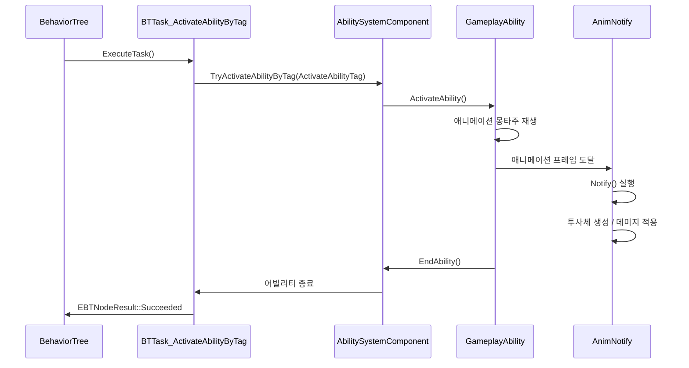

**코드:**

```cpp
EBTNodeResult::Type UBTTask_ActivateAbilityByTag::ExecuteTask(
    UBehaviorTreeComponent& OwnerComp, uint8* NodeMemory)
{
    AAIController* AIC = OwnerComp.GetAIOwner();
    AFDMonsterCharacter* Monster = Cast<AFDMonsterCharacter>(AIC->GetPawn());
    
    if (Monster)
    {
        if (UAbilitySystemComponent* ASC = Monster->GetAbilitySystemComponent())
        {
            // GameplayTag로 어빌리티 활성화
            bool bSuccess = ASC->TryActivateAbilitiesByTag(
                FGameplayTagContainer(ActivateAbilityTag));
            
            return bSuccess ? EBTNodeResult::Succeeded : EBTNodeResult::Failed;
        }
    }
    
    return EBTNodeResult::Failed;
}
```

### BT Decorator: CanUseAbilityByTag

**쿨다운 확인:**

```cpp
bool UBTDecorator_CanUseAbilityByTag::CalculateRawConditionValue(
    UBehaviorTreeComponent& OwnerComp, uint8* NodeMemory) const
{
    AAIController* AIC = OwnerComp.GetAIOwner();
    AFDMonsterCharacter* Monster = Cast<AFDMonsterCharacter>(AIC->GetPawn());
    
    if (Monster)
    {
        if (UAbilitySystemComponent* ASC = Monster->GetAbilitySystemComponent())
        {
            // 어빌리티가 활성화 가능한지 확인 (쿨다운 등)
            FGameplayTagContainer AbilityTags;
            AbilityTags.AddTag(AbilityTag);
            
            return ASC->GetActivatableAbilities().Num() > 0 &&
                   !ASC->HasMatchingGameplayTag(CooldownTag);
        }
    }
    
    return false;
}
```

---

## 네트워크 동기화 및 RPC

### Replication 설정

```cpp
void AFDMonsterCharacter::GetLifetimeReplicatedProps(
    TArray<class FLifetimeProperty>& OutLifetimeProps) const
{
    Super::GetLifetimeReplicatedProps(OutLifetimeProps);
    
    DOREPLIFETIME(AFDMonsterCharacter, TargetActor);
}

void AFDBossCharacter::GetLifetimeReplicatedProps(
    TArray<class FLifetimeProperty>& OutLifetimeProps) const
{
    Super::GetLifetimeReplicatedProps(OutLifetimeProps);
    
    DOREPLIFETIME_CONDITION_NOTIFY(AFDBossCharacter, bIsBerserk, 
        COND_None, REPNOTIFY_Always);
    DOREPLIFETIME_CONDITION_NOTIFY(AFDBossCharacter, BossPartsInfo, 
        COND_None, REPNOTIFY_Always);
}
```

### RPC 사용 패턴

#### 1. Multicast RPC (모든 클라이언트 동기화)

**데미지 UI 표시:**

```cpp
UFUNCTION(NetMulticast, Unreliable)
void Multicast_ShowDamageUI(float Damage, FVector HitLocation, 
    AController* InstigatorController);

void AFDMonsterCharacter::Multicast_ShowDamageUI_Implementation(
    float Damage, FVector HitLocation, AController* InstigatorController)
{
    APlayerController* LocalPC = GetWorld()->GetFirstPlayerController();
    APawn* LocalPawn = LocalPC ? LocalPC->GetPawn() : nullptr;
    APawn* InstigatorPawn = InstigatorController ? 
        InstigatorController->GetPawn() : nullptr;
    
    // 데미지를 입힌 플레이어의 클라이언트에서만 UI 표시
    if (LocalPawn == InstigatorPawn)
    {
        FVector RandomOffset(
            FMath::FRandRange(-100.f, 100.f),
            FMath::FRandRange(-100.f, 100.f),
            FMath::FRandRange(0.f, 50.f)
        );
        FVector FinalLocation = HitLocation + RandomOffset;
        
        SpawnWidget(Damage, FinalLocation);
    }
}
```

**몬스터 사망 처리:**

```cpp
UFUNCTION(NetMulticast, Reliable)
void Multicast_MonsterDead(AActor* HitActor);

void AFDMonsterCharacter::Multicast_MonsterDead_Implementation(AActor* HitActor)
{
    if (AFDBossCharacter* Boss = Cast<AFDBossCharacter>(HitActor))
    {
        Boss->GetMesh()->SetCollisionEnabled(ECollisionEnabled::NoCollision);
        Boss->GetCapsuleComponent()->SetCollisionEnabled(ECollisionEnabled::NoCollision);
    }
    if (AFDMINCharacter* MIN = Cast<AFDMINCharacter>(HitActor))
    {
        MIN->GetMesh()->SetCollisionEnabled(ECollisionEnabled::NoCollision);
        MIN->GetCapsuleComponent()->SetCollisionEnabled(ECollisionEnabled::NoCollision);
        MIN->GetMeleeCollision()->SetCollisionEnabled(ECollisionEnabled::NoCollision);
    }
}
```

**보스 HUD 업데이트:**

```cpp
UFUNCTION(NetMulticast, Reliable)
void Multicast_UpdateBossHUD(AActor* HitActor, float CurrentHp, float MaxHp, 
    float CurrentShield, float MaxShield);

void AFDMonsterCharacter::Multicast_UpdateBossHUD_Implementation(AActor* HitActor, 
    float CurrentHp, float MaxHp, float CurrentShield, float MaxShield)
{
    if (AFDBossCharacter* Boss = Cast<AFDBossCharacter>(HitActor))
    {
        // 델리게이트를 통해 모든 클라이언트의 UI 업데이트
        Boss->OnBossStatChanged.Broadcast(CurrentHp, MaxHp, CurrentShield, MaxShield);
    }
}
```

#### 2. RepNotify (변수 복제 알림)

```cpp
UPROPERTY(ReplicatedUsing = OnRep_TargetActor)
AActor* TargetActor;

UFUNCTION()
void OnRep_TargetActor();

void AFDMonsterCharacter::OnRep_TargetActor()
{
    if (AAIController* AIC = Cast<AAIController>(GetController()))
    {
        if (UBlackboardComponent* BB = AIC->GetBlackboardComponent())
        {
            // 클라이언트 측에서도 Blackboard 업데이트
            BB->SetValueAsObject("TargetActor", TargetActor);
        }
    }
}
```

### 네트워크 권한 체크

```cpp
void AFDMonsterCharacter::UpdateNearestTarget()
{
    if (!HasAuthority()) return; // 서버에서만 실행
    // ...
}

void AFDBossCharacter::StartBerserk()
{
    if (bIsBerserk || !HasAuthority()) return; // 서버 전용
    // ...
}

void AFDMonsterCharacter::SpawnWidget(float Damage, FVector SpawnLocation)
{
    if (HasAuthority()) return; // 클라이언트에서만 실행 (UI는 로컬)
    // ...
}
```

### 네트워크 동기화 플로우

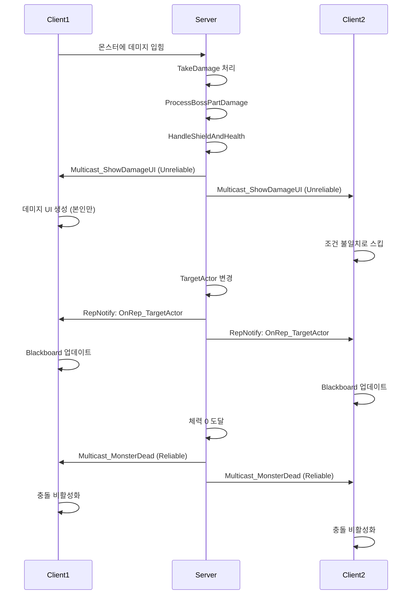

---

## 핵심 설계 패턴 요약

### 1. OOP 설계 원칙

| 원칙                           | 적용 사례                                                                     |
| ------------------------------ | ----------------------------------------------------------------------------- |
| **단일 책임 원칙 (SRP)**       | `EnemyCombatComponent`는 전투만, `EnemyAttributeSet`는 스탯만 관리            |
| **개방-폐쇄 원칙 (OCP)**       | `EnemyGameplayAbility` 베이스 클래스를 상속하여 새로운 패턴 추가 가능         |
| **리스코프 치환 원칙 (LSP)**   | `AFDBossCharacter`와 `AFDMINCharacter` 모두 `AFDMonsterCharacter`로 대체 가능 |
| **인터페이스 분리 원칙 (ISP)** | `IPawnCombatInterface`, `IAbilitySystemInterface` 등 최소 인터페이스          |
| **의존성 역전 원칙 (DIP)**     | 구체 클래스가 아닌 인터페이스에 의존 (IAbilitySystemInterface)                |

### 2. 디자인 패턴

- **Component Pattern**: 기능을 컴포넌트로 분리 (EnemyCombatComponent, ASC)
- **Observer Pattern**: 델리게이트를 통한 이벤트 기반 통신 (OnBossStatChanged)
- **State Pattern**: Berserk 모드 전환 (Normal ⇄ Berserk)
- **Strategy Pattern**: 데미지 처리 전략 (Normal 모드 vs Berserk 모드)
- **Factory Pattern**: AnimNotify에서 액터 생성 (Projectile, MeleeAttack)

### 3. GAS 통합

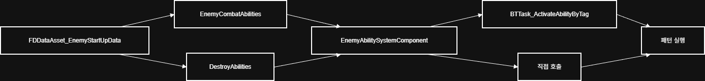

**어빌리티 부여:**

```cpp
void UFDDataAsset_EnemyStartUpData::GiveToAbilitySystemComponent(
    UFDAbilitySystemComponent* InASCToGive, int32 ApplyLevel)
{
    for (const TSubclassOf<UEnemyGameplayAbility>& Ability : EnemyCombatAbilities)
    {
        if (!Ability) continue;
        
        FGameplayAbilitySpec AbilitySpec(Ability);
        AbilitySpec.SourceObject = InASCToGive->GetAvatarActor();
        AbilitySpec.Level = ApplyLevel;
        
        InASCToGive->GiveAbility(AbilitySpec);
    }
}
```

---

## 결론

ProjectFD의 몬스터 시스템은 다음과 같은 특징을 가집니다:

1. **OOP 기반 계층 구조**: 상속과 컴포넌트 패턴을 조합한 클래스 설계
2. **GAS 통합 전투 시스템**: 태그 기반 어빌리티 활성화를 통한 패턴 관리
3. **Parts 기반 다층 데미지 시스템**: 파츠별 독립적인 데미지 처리 및 기믹 연동
4. **멀티플레이어 네트워크 구조**: RPC와 RepNotify를 통한 상태 동기화
5. **애니메이션 이벤트 기반 패턴 실행**: AnimNotify/State를 활용한 스킬 타이밍 제어

이 시스템은 확장성, 유지보수성, 네트워크 동기화를 고려하여 설계되었습니다.
